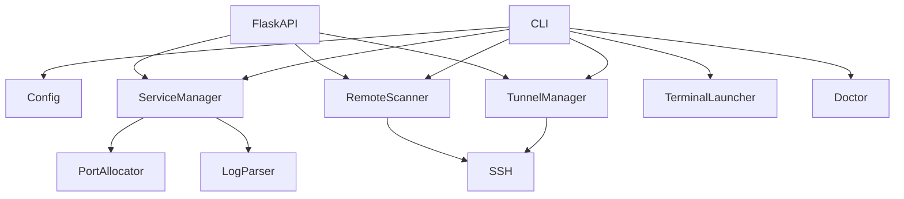

# LocalSM architecture

## Module relationships



## Local service lifecycle

LocalSM creates a new session per service and runs the configured `start`
command as a detached child process:

```text
LocalSM up
  ├─ read ~/.config/localsm/services.yaml
  ├─ reuse the sticky port, or pick the preferred/fallback port
  ├─ start the shell command
  ├─ write <state>/pids/<service>.pid
  └─ append stdout/stderr to <state>/logs/<service>.log
```

`status` builds its answer from a pid liveness check and log parsing. LocalSM
exiting does not affect the child; `down` sends SIGTERM first and SIGKILL after
the grace period. Externally supervised services can be folded into the same
view passively through `status_cmd`.

## Locating configuration and state

Paths are resolved by lazy functions in
[`config.py`](../../src/localsm/config.py), independent of where LocalSM itself
is installed: configuration defaults to `~/.config/localsm/` and state to
`~/.local/state/localsm/`, both overridable with `LOCALSM_CONFIG_DIR`,
`LOCALSM_STATE_DIR`, `LOCALSM_ROOT`, or the XDG variables. Lazy resolution means
changing an environment variable inside the process takes effect immediately, so
tests do not have to arrange the environment before import.

## Port allocation

Ports are chosen in this order:

1. An explicit `--port` from the user
2. The port this service last used successfully, from `ports.json` in the state
   directory
3. `preferred_port`
4. The service's range or the global `port_pool`, when `--auto-port` is on

Every candidate is probed with a bind on local loopback. A successful allocation
is written to `ports.json` immediately, which is why a restart usually lands back
on the same port.

## Remote scans

Each SSH host is probed in parallel through its own `ssh` invocation. The remote
listener command degrades in this order:

```text
ss -ltnH
  → lsof -nP -iTCP -sTCP:LISTEN
  → netstat -lnt
  → python3 reading /proc/net/tcp*
```

Results are saved to `remote_scan.json` in the state directory. The web page
scans on demand and, when reading the cache, uses the file's mtime to show when
the last scan happened.

## Tunnel lifecycle

Tunnel rules live only in `~/.config/localsm/tunnels.yaml`; LocalSM never
modifies the user's SSH config:

```text
tunnel add
  → check the local port
  → detached ssh -N -L
  → write the tunnel pidfile

tunnel ensure
  → pid alive? leave it
  → pid gone? rebuild from the YAML rule
```

## The web layer

Flask only serves the HTTP API and static assets. The front end is build-free ES
modules:

```text
app.js
  ├─ services.js → /api/services, /api/logs
  ├─ remote.js   → /api/remote, /api/remote/scan, /api/ssh
  └─ tunnels.js  → /api/tunnels
```

The five-second auto-refresh only polls local services and tunnels. Remote scans
are triggered explicitly by the user, so nothing opens SSH connections
continuously in the background.
