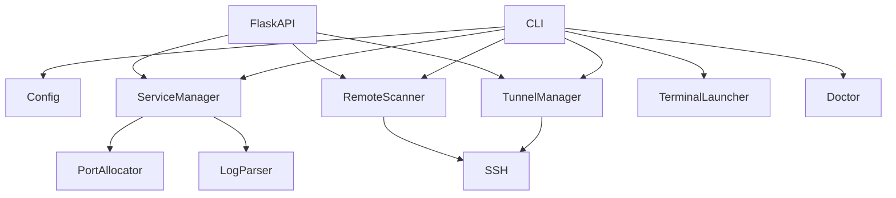

# LocalSM 架构

## 模块关系



## 本地服务生命周期

LocalSM 为每个服务创建一个新的 session，以 detached 子进程执行配置中的
`start` 命令：

```text
LocalSM up
  ├─ 读取 ~/.config/localsm/services.yaml
  ├─ 复用 sticky port 或选择 preferred/fallback port
  ├─ 启动 shell 命令
  ├─ 写入 <state>/pids/<service>.pid
  └─ 将 stdout/stderr 追加到 <state>/logs/<service>.log
```

`status` 通过 pid 存活检查和日志解析生成状态。LocalSM 退出不会影响子进程；
`down` 先发送 SIGTERM，超时后发送 SIGKILL。外部托管服务可用
`status_cmd` 被动纳入状态展示。

## 配置与状态定位

路径由 [`config.py`](../../src/localsm/config.py) 的惰性函数解析，与 LocalSM
自身的安装位置无关：配置默认在 `~/.config/localsm/`，状态在
`~/.local/state/localsm/`，均可用 `LOCALSM_CONFIG_DIR`、`LOCALSM_STATE_DIR`、
`LOCALSM_ROOT` 或 XDG 变量覆盖。惰性解析意味着进程内改环境变量即时生效，
测试因此不必在 import 之前布置环境。

## 端口分配

端口选择顺序为：

1. 用户明确传入的 `--port`；
2. 状态目录 `ports.json` 中该服务上次成功使用的端口；
3. `preferred_port`；
4. `--auto-port` 开启时的服务范围或全局 `port_pool`。

每个候选端口都会在本机 loopback 上进行 bind 探测。成功分配后立即写入
`ports.json`，因此服务重启时通常会回到同一个端口。

## 远端扫描

每个 SSH Host 通过独立的 `ssh` 调用并行探测。远端 listener 命令按以下顺序
降级：

```text
ss -ltnH
  → lsof -nP -iTCP -sTCP:LISTEN
  → netstat -lnt
  → python3 读取 /proc/net/tcp*
```

扫描结果保存到状态目录的 `remote_scan.json`。Web 页面按需扫描，读取缓存时用
文件修改时间展示上次扫描时间。

## 隧道生命周期

隧道规则只存储在 `~/.config/localsm/tunnels.yaml`，LocalSM 不修改用户的
SSH config：

```text
tunnel add
  → 检查本地端口
  → detached ssh -N -L
  → 写入 tunnel pidfile

tunnel ensure
  → pid 存活？保留
  → pid 不存在？按 YAML 规则重新建立
```

## Web 层

Flask 只负责 HTTP API 和静态资源托管。前端是无构建的 ES modules：

```text
app.js
  ├─ services.js → /api/services, /api/logs
  ├─ remote.js   → /api/remote, /api/remote/scan, /api/ssh
  └─ tunnels.js  → /api/tunnels
```

5 秒自动刷新只轮询本机服务和隧道；远端扫描由用户显式触发，避免后台持续
建立 SSH 连接。
